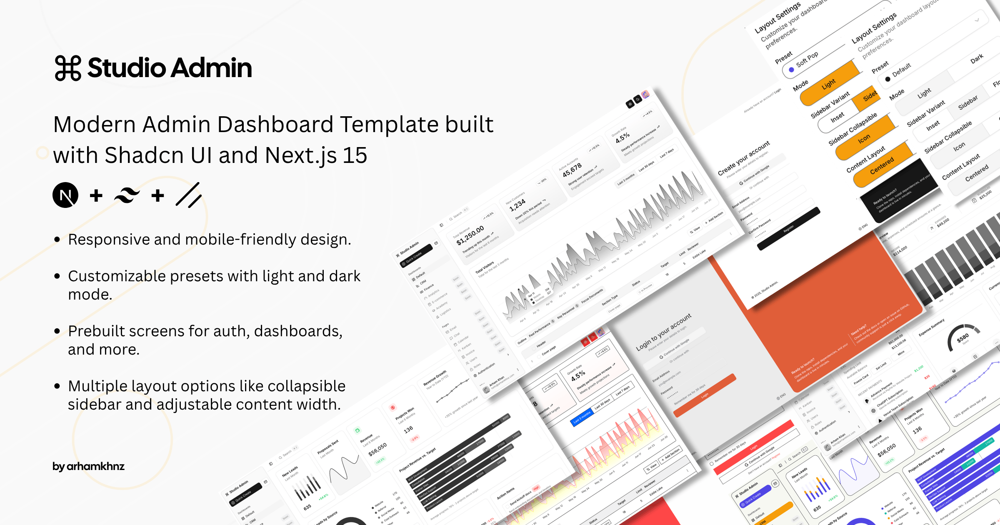

# Ship Tracking Admin Dashboard

A comprehensive maritime fleet management and ship tracking dashboard built with Next.js, TypeScript, and Supabase. Features real-time vessel monitoring using VesselFinder integration with web scraping capabilities.



## 🚢 Features

### Maritime Fleet Management
- **Real-time Ship Tracking** - Monitor vessel locations, speed, course, and status
- **VesselFinder Integration** - Direct URL-based vessel data scraping 
- **Fleet Overview** - Comprehensive dashboard with ship status and locations
- **Interactive Maps** - Visual ship positioning with detailed information
- **Vessel Details** - Complete ship specifications, images, and tracking history

### Ship Data Management
- **CRUD Operations** - Add, edit, delete, and view ship records
- **Authentication Management** - Ship email credentials and app passwords
- **URL Management** - Configure VesselFinder URLs for each vessel
- **Search & Filtering** - Find ships by name, email, or status
- **Bulk Operations** - Manage multiple ships efficiently

### Real-time Tracking
- **Location Data** - GPS coordinates, port information, destinations
- **Status Monitoring** - Underway, At Anchor, Moored statuses with visual indicators
- **Speed & Course** - Live navigation data in knots and degrees
- **Image Integration** - Latest vessel imagery from VesselFinder
- **Maritime Identifiers** - MMSI and IMO number tracking

### User Management
- **Supabase Authentication** - Secure user login and registration
- **Employee Directory** - Staff management with role-based access
- **Role-based Access Control** - Different permission levels
- **Profile Management** - User settings and preferences

## 🛠 Tech Stack

- **Frontend**: Next.js 15 (App Router), TypeScript, Tailwind CSS v4
- **UI Components**: Shadcn UI with custom maritime themes
- **Database**: Supabase (PostgreSQL)
- **Authentication**: Supabase Auth
- **Data Fetching**: Server-side API routes with web scraping
- **Validation**: Zod schemas
- **State Management**: React Hook Form, Zustand
- **Data Tables**: TanStack Table with sorting and filtering
- **Maps**: Interactive vessel positioning
- **Development**: ESLint, Prettier, Husky

## 🚀 Getting Started

### Prerequisites
- Node.js 18+ 
- npm or yarn
- Supabase account

### Installation

1. **Clone the repository**
   ```bash
   git clone https://github.com/APS4087/my-admin-dashboard.git
   cd my-admin-dashboard
   ```

2. **Install dependencies**
   ```bash
   npm install
   ```

3. **Set up environment variables**
   ```bash
   cp .env.example .env.local
   ```
   
   Configure your `.env.local` file:
   ```env
   NEXT_PUBLIC_SUPABASE_URL=your_supabase_project_url
   NEXT_PUBLIC_SUPABASE_ANON_KEY=your_supabase_anon_key
   SUPABASE_SERVICE_ROLE_KEY=your_service_role_key
   ```

4. **Set up Supabase database**
   
   Follow the detailed setup guide in `SUPABASE_SETUP.md`:
   - Create Supabase project
   - Run database migrations
   - Configure authentication
   - Set up row-level security

5. **Start development server**
   ```bash
   npm run dev
   ```

   Open [http://localhost:3000](http://localhost:3000) in your browser.

## 📁 Project Structure

```
src/
├── app/
│   ├── (main)/dashboard/
│   │   ├── ships/              # Ship management pages
│   │   │   ├── [id]/           # Individual ship details
│   │   │   ├── add/            # Add new ship
│   │   │   ├── manage-urls/    # VesselFinder URL management
│   │   │   ├── test/           # Vessel scraping tests
│   │   │   └── url-test/       # URL validation tools
│   │   └── employees/          # Employee management
│   ├── api/
│   │   ├── scrape-vessel/      # VesselFinder search API
│   │   └── scrape-vessel-detail/ # Individual vessel data API
│   └── auth/                   # Authentication pages
├── components/
│   ├── ship-map.tsx           # Interactive ship maps
│   ├── data-table/            # Reusable table components
│   └── ui/                    # Shadcn UI components
├── lib/
│   ├── ship-service.ts        # Ship CRUD operations
│   ├── ship-tracking-service.ts # Vessel tracking integration
│   ├── vessel-scraper-service.ts # Web scraping logic
│   └── supabase/              # Database client
├── types/
│   ├── ship.ts                # Ship data interfaces
│   └── auth.ts                # Authentication types
└── hooks/                     # Custom React hooks
```

## 🗺 Key Features Guide

### Ship Tracking Dashboard
Navigate to `/dashboard/ships` to:
- View all ships in your fleet
- See real-time locations and status
- Search and filter vessels
- Access individual ship details

### VesselFinder Integration
The system integrates with VesselFinder.com through:
- **URL-based tracking** - Each ship can have a VesselFinder detail page URL
- **Web scraping** - Automated data extraction for locations, images, and details
- **URL management** - Tools to configure and validate VesselFinder URLs
- **Fallback data** - Mock data when scraping fails for development

### Ship Detail Views
Each ship has a comprehensive detail page showing:
- Authentication credentials
- Real-time location with interactive map
- Vessel specifications and images
- Tracking history and status updates

### Testing Tools
Development and testing utilities:
- `/dashboard/ships/test` - Test vessel search functionality
- `/dashboard/ships/url-test` - Validate VesselFinder URLs
- `/dashboard/ships/manage-urls` - Bulk URL management

## 🔧 Configuration

### VesselFinder URLs
Ships can be tracked using specific VesselFinder vessel detail pages:
```
https://www.vesselfinder.com/vessels/details/[VESSEL_ID]
```

Use the URL management interface to configure tracking sources for each vessel.

### Database Schema
Key tables:
- `ships` - Vessel records with authentication
- `employees` - User management
- `profiles` - User profiles linked to Supabase auth

See migration files in `supabase/migrations/` for complete schema.

## 🚀 Deployment

### Deploy to Vercel

1. **Connect to Vercel**
   ```bash
   npm i -g vercel
   vercel
   ```

2. **Configure environment variables** in Vercel dashboard

3. **Deploy**
   ```bash
   vercel --prod
   ```

### Environment Variables for Production
```env
NEXT_PUBLIC_SUPABASE_URL=your_production_supabase_url
NEXT_PUBLIC_SUPABASE_ANON_KEY=your_production_anon_key
SUPABASE_SERVICE_ROLE_KEY=your_production_service_role_key
```

## 📚 Documentation

- `docs/ship-tracking.md` - Detailed ship tracking features
- `docs/vessel-scraping-guide.md` - VesselFinder integration guide
- `SUPABASE_SETUP.md` - Complete database setup instructions

## 🤝 Contributing

1. Fork the repository
2. Create a feature branch (`git checkout -b feature/amazing-feature`)
3. Make your changes
4. Run tests (`npm run lint`)
5. Commit changes (`git commit -m 'Add amazing feature'`)
6. Push to branch (`git push origin feature/amazing-feature`)
7. Open a Pull Request

## 📝 License

This project is licensed under the MIT License - see the [LICENSE](LICENSE) file for details.

## 🆘 Support

- Check the documentation in the `docs/` folder
- Review setup instructions in `SUPABASE_SETUP.md`
- Create an issue for bugs or feature requests

---

**Built for maritime professionals who need comprehensive fleet tracking and management capabilities.**
